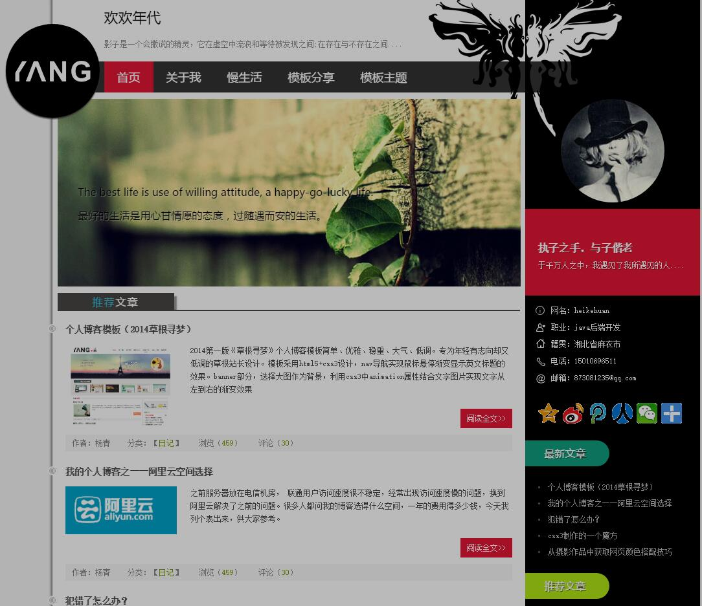

# huanhuan-blog

### 前言 ###

这是一个个人博客的项目，用于展示自己写的一些文章，和个人联系方式。

建立这个项目的目的，主要是拿freemarker练练手。在分支里包含了各个实验田。

- spring-xml分支

最原始的spring配置方式，xml文件配置各个bean，在web.xml配置文件加载spring配置文件。

- spring-xml-profile分支

在上一个分支的基础上，利用了spring profile功能，加上自动切换环境的配置。不了解基本概念的，请自行百度spring profile。

- spring-xml-mapper-profile分支

在上一个分支的基础上，加上mybatis一个非常好用的插件：通用mapper。详情请看http://git.oschina.net/free/Mapper

- spring-boot分支

重写代码，使用全新框架spring-boot，跟master分支代码完全相同。包含的功能最新最全。

- redis-cache分支

在上一个分支的基础上，尝试使用redis作为缓存。

### 软件环境 ###
IntelliJ IDEA 15.0

jdk 1.8

maven 3.3.9

### 使用的技术 ###
目前是初期，使用springmvc + spring + mybatis + freemarker

后期会陆续加入其他技术，将会更新到此文档

### 使用建议 ###

**huanhuan-blog** 是一个通用JavaWeb项目骨架，使用业内最佳技术实践作为基础组件。

springmvc同时兼容本地化javaweb的路由，和restful风格，成为当仁不让的最佳选择。（我会在后期的branch里加入一个restful前后端分离的风格）。

mybatis使用原生sql，对于sql熟手来说，在开发难度和性能上，都优于hibernate。

huanhuan-blog作为一个种子项目，你可以基于它，快速搭建项目原型，并基于自己的业务场景修改源码。

### 更新日志 ###

#### 2.0 ####

1. 博客内容使用数据库的表数据填充，不再写死。
2. 优化增删改查，封装mybatis最基础的CRUD
3. 项目框架换成spring-boot

#### 1.0 ####

1. 搭建基础环境，完成CRUD基础搭建，并在controller类，写出一个简单的查询。

------

### 怎么使用本项目 ###

1. git clone git@github.com:heikehuan/huanhuan-blog.git
2. 在MySQL中导入 huanhuan-blog/src/main/resources/test.sql 脚本
3. 更新 huanhuan-blog/src/main/resources/datasource.properties 中jdbc.user和jdbc.password的值
4. cd huanhuan-blog
5. mvn war:war
6. 把 huanhuan-blog/target/huanhuan-blog-1.0-SNAPSHOT.war 发布在App Server(Tomcat、JBOSS) 中

### 在IDE 中查看源码并运行 ###

**1. 在IntelliJ IDEA (推荐使用)**

File -> Import Project -> select huanhuan-blog folder -> create project form existing sources -> ...

**2. 在Eclipse**

File -> Import -> Existing Maven Projects -> ...

### 效果图

